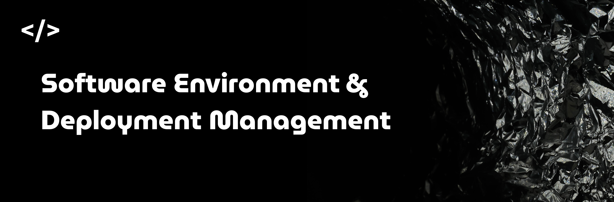
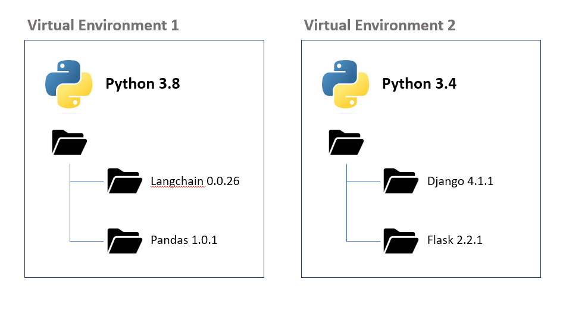
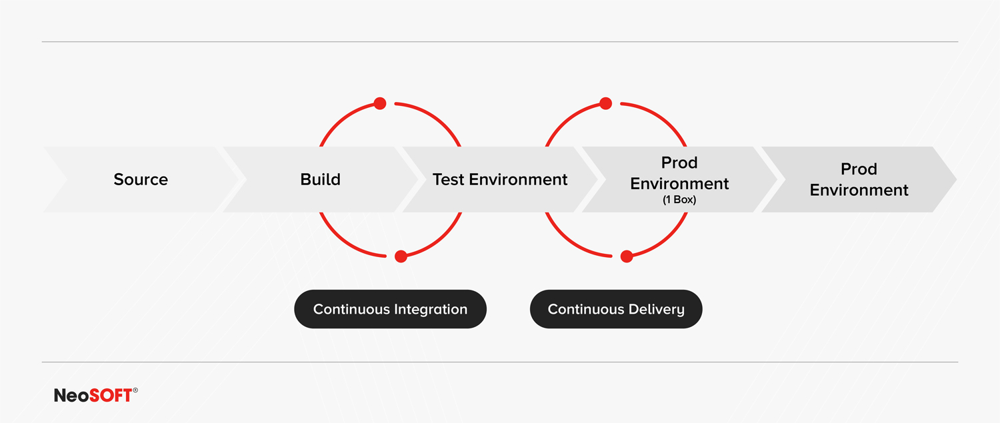

  

# Software Environment Management

> A practical tour of how developers control **where** code runs, **which** dependencies it sees, and **how** it moves from laptop to production.

This topic sits inside **DevOps / Platform Engineering**.  
You can think of it as:

> **Software Environment & Deployment Management**  
> (how we manage environments + how code moves between them).

The developer doesn’t just “write code”. They have to decide:

- Which Python environment?
- Local machine or Docker?
- Colab or a GPU VM?
- Dev, staging, or production?
- GitHub Actions or Jenkins?

The goal of this repo is to connect all the pieces in one narrative:  
from `venv` and `conda`, to Docker, VMs, cloud notebooks, CI runners, and Terraform –  

---

## 1. The Core Problem: “It Works on My Machine”

Everything here exists because of one sentence:

> “It works on my machine.”

Different operating systems, library versions, Python/Node runtimes, CPU vs GPU, cloud vs on-prem.  
When environments are not controlled, we get:

- code that only runs on the author’s laptop  
- hidden differences between dev, test, and prod  
- broken deployments because “prod is slightly different”

**Environment management** is about making all of this explicit and repeatable.

At a high level you can think of four layers:

1. **Language-level environments** – Python, Node.js, Ruby, Java, etc.  
2. **Machine-level isolation** – containers and virtual machines.  
3. **Execution context** – cloud notebooks, CI/CD runners.  
4. **Lifecycle environments & infra** – dev / test / prod plus Terraform, Ansible, etc.

If any word here feels new, check  
**[10. Terminology & Synonyms](#10-terminology--synonyms-beginner-friendly)** while you read.

---

## 2. Language-Level Environments

Language-level environments answer a simple question:

> “Which runtime and which libraries does this project use?”

Instead of installing everything globally, we create **isolated environments** per project so that:

- projects don’t break each other  
- we can recreate the same setup on any machine

### 2.1 Python Environments

  

For Python, this usually means a **virtual environment** with pinned dependencies.

Typical tools:

- `venv`
- `virtualenv`
- `conda`
- `poetry`
- `pipenv`

They all solve some version of:

- “Keep each project’s dependencies separate.”
- “Make installs reproducible.”
- “Avoid global mess.”

Definitions and synonyms for these tools live in  
**[10.2 Python / Language Envs](#102-python--language-envs)**.

### 2.2 JavaScript / Node.js Environments

For Node.js, the environment is mostly:

- **Node.js version**
- **Project dependencies** in `node_modules`

You’ll see tools like:

- `nvm` (Node Version Manager)
- `package.json` + lockfiles
- the `node_modules` folder

What matters is:

- pinning the Node version  
- locking dependency versions so every developer and CI run uses the same graph

Terminology for these tools is in  
**[10.3 Node.js / JavaScript](#103-nodejs--javascript)**.

### 2.3 Other Language-Specific Environments

Other ecosystems have their own environment managers:

- Ruby: `rbenv`, `RVM`
- Java: JVM + build tools
- .NET: .NET CLR and tooling
- Rust: `rustup`
- Go: Go modules

The pattern is always:

> Fix the language version + lock the dependency graph → reproducible builds.

See **[10.2 Python / Language Envs](#102-python--language-envs)**  
and **[10.3 Node.js / JavaScript](#103-nodejs--javascript)** for language-env terms,  
and **[10.8 Infrastructure & Config](#108-infrastructure--config)** for “modules” and similar words.

---

## 3. Containers: Packaging the Whole Runtime

  

Language environments isolate libraries.  
**Containers** package *the app + runtime + OS-level dependencies* together.

With containers, the same **image** can:

- run on your laptop  
- run in CI  
- run in production  

as long as there is a container runtime.

Key tools/terms here:

- Docker, Podman, LXC/LXD
- container, image, registry

If you’re not sure what “container” or “image” mean, jump to  
**[10.4 Containers & VMs](#104-containers--vms)**.

You can think of a container as:

> “A portable box that carries everything the app needs to run.”

---

## 4. Virtual Machines: Full OS Virtualization

  

Containers share the host OS kernel.  
Sometimes you need a **full separate OS**. That’s where **Virtual Machines (VMs)** come in.

Typical tools:

- VirtualBox
- VMware
- Hyper-V
- KVM

Use cases:

- strong isolation  
- running a different OS family  
- legacy software that expects a full server

Concepts like **VM**, **host**, and **guest** are explained in  
**[10.4 Containers & VMs](#104-containers--vms)**.

In many setups, you’ll see a stack like:

> Cloud VM → Docker container → Python env inside the container.

Layers all the way down.

---

## 5. Cloud Execution Environments

  

Sometimes you don’t manage servers at all.  
You open a browser and get a ready-to-use environment with compute attached.

Examples:

- Google Colab  
- Kaggle Notebooks  
- AWS SageMaker  
- Azure ML Studio  
- GitHub Codespaces  
- Google Vertex AI Notebooks  
- Paperspace / Gradient  

These are great for experiments and short-lived work. They are often:

- **managed notebook environments**
- **ephemeral environments** (created on demand, then destroyed)

Definitions for “managed notebook”, “ephemeral environment”, etc. are under  
**[10.5 Cloud / Notebooks](#105-cloud--notebooks)**.

---

## 6. Application Lifecycle Environments (Dev → Prod)

Even with perfect containers, you don’t push straight to production.  
Real systems use multiple **lifecycle environments** so changes can be tested gradually.

Common ones:

- Development (Dev)  
- Testing (Test)  
- QA (Quality Assurance)  
- UAT (User Acceptance Testing)  
- Staging  
- Sandbox  
- Production (Prod)

These are often called **lower environments** (everything that is not prod).

The important idea:

> Each environment is a different “copy of reality” where we test at different levels of risk.

All these terms are defined in  
**[10.6 Lifecycle Environments](#106-lifecycle-environments)**.

---

## 7. Build & CI/CD Environments

  

When you push code, systems like GitHub or GitLab can:

- run tests  
- build artifacts or images  
- deploy to environments

This is CI/CD:

- **CI** – Continuous Integration  
- **CD** – Continuous Delivery or Deployment  

Platforms:

- GitHub Actions  
- GitLab CI  
- Jenkins  
- Azure DevOps Pipelines  

Concepts like **pipeline**, **workflow**, **runner**, **agent**, **job**  
are explained in **[10.7 CI/CD](#107-cicd)**.

These CI/CD environments are usually **ephemeral**:  
spin up → run → disappear.

---

## 8. Infrastructure & Configuration Environments

  

Environments are not just about apps.  
They also include the servers, networks, databases, and configuration behind them.

Tools like:

- Terraform  
- Ansible  
- Puppet  
- Chef  

implement **Infrastructure as Code (IaC)**.

Instead of “someone clicked around in the cloud console”, we have:

- code that describes infrastructure  
- version control  
- repeatable deployments of whole environments

Terms like **IaC**, **declarative config**, **playbook**, **module**  
are detailed in **[10.8 Infrastructure & Config](#108-infrastructure--config)**.

---

## 9. How Everything Fits Together

One way to see the full picture:

1. **Language-level envs**  
   Python `venv`/`conda`, Node `nvm`, Ruby `rbenv`, etc.  
   → control runtimes and dependencies. 
2. **Containers & VMs**  
   Docker, Podman, VirtualBox, etc.  
   → control OS-level packaging and isolation.  

3. **Cloud execution & CI/CD environments**  
   Colab, SageMaker, GitHub Actions, GitLab CI, Jenkins.  
   → where code actually runs for experiments and automation.  

4. **Lifecycle environments (dev → prod)**  
   Dev, Test, QA, UAT, Staging, Sandbox, Prod.  
   → how features move from idea to real users.  

5. **Infra & configuration**  
   Terraform, Ansible, Puppet, Chef.  
   → how the underlying infrastructure is defined and kept in sync.  

All of this is what we call:

> **Software Environment & Deployment Management**  
> a core part of **DevOps / Platform Engineering**.

The main idea:

- Make environments **explicit**.  
- Make them **reproducible**.  
- Make the path from **laptop to production** boring and predictable.

---

## 10. Terminology & Synonyms

  

This section is the reference for all jargon in the repo.  
Sections above intentionally keep explanations short and point here.

### 10.1 Basics

- **Environment**  
  Where your code runs: OS + runtime + libraries + configs.  
  Synonyms: runtime, execution context, stack.

- **Dependency**  
  A library or package your project needs to work (e.g. `numpy`, `react`).  
  Synonyms: library, package, module.

- **Runtime**  
  The engine that executes your code (Python interpreter, Node.js, JVM, .NET CLR).  
  Synonyms: language runtime, execution engine.

### 10.2 Python / Language Envs

- **Virtual Environment (venv)**  
  Isolated folder with its own Python and packages, separate from system Python.  
  Common names: `venv`, `.venv`, `env`.

- **virtualenv**  
  Tool (older than `venv`) to create Python virtual environments.  
  Often used in older projects or with specific workflows.

- **conda**  
  Environment + package manager from Anaconda.  
  Can install Python and non-Python libs (like CUDA, MKL, etc.).  
  Used a lot in data science and ML.

- **poetry**  
  Modern tool that manages dependencies, virtual envs, and packaging using `pyproject.toml`.  
  Outputs a `poetry.lock` file to pin versions.

- **pipenv**  
  Tool that combines `pip` + virtualenv with a `Pipfile` and `Pipfile.lock`.  
  Focuses on deterministic dependency resolution.

### 10.3 Node.js / JavaScript

- **nvm (Node Version Manager)**  
  Manages multiple Node.js versions on the same machine.  
  Lets you run `nvm use 18` for one project and `nvm use 20` for another.

- **node_modules**  
  Directory where Node.js packages are installed for a project.  
  Usually ignored in git because it’s reproducible from `package.json` + lockfile.

- **package.json**  
  Manifest file that lists dependencies, scripts, and metadata for a Node project.

- **Lockfile** (`package-lock.json`, `yarn.lock`, `pnpm-lock.yaml`)  
  Pins exact versions of dependencies to make installs reproducible.

### 10.4 Containers & VMs

- **Container**  
  Lightweight, isolated environment running on the host OS kernel.  
  Shares the kernel but has its own filesystem, processes, and network namespace.

- **Image**  
  Read-only template used to create containers.  
  Contains OS layers, runtimes, libraries, and app code.

- **Container registry**  
  Remote repository that stores and serves container images (e.g. Docker Hub, ECR, GCR).

- **VM (Virtual Machine)**  
  Emulated computer with its own OS and virtual hardware.  
  Runs on top of a hypervisor.

- **Host**  
  Physical or base machine that runs VMs or containers.

- **Guest**  
  The OS that runs inside a VM.

### 10.5 Cloud / Notebooks

- **Managed notebook**  
  Notebook environment provided by a cloud platform (Colab, SageMaker Studio, etc.).  
  You don’t manage servers directly; the platform does.

- **Ephemeral environment**  
  Short-lived environment created for a specific task; destroyed afterwards.  
  Common in CI/CD, preview deployments, and cloud notebooks.

### 10.6 Lifecycle Environments

- **Development (Dev)**  
  Environment where developers write, debug, and experiment with new features.  
  Often has mock data and relaxed constraints.

- **Testing (Test)**  
  Environment mainly used by automated tests and integration checks.

- **QA (Quality Assurance)**  
  Environment where QA teams run manual or semi-automated tests, regressions, and edge cases.

- **UAT (User Acceptance Testing)**  
  Environment where business users or stakeholders validate that the feature meets requirements.

- **Staging**  
  Production-like environment used as a final check before deployment.  
  Often configured to mirror prod closely.

- **Sandbox**  
  Safe playground for experiments, demos, or external integrations.  
  Breaking it should not affect real users.

- **Production (Prod)**  
  Live environment used by real customers and real data.

- **Lower environments**  
  All non-production environments (dev, test, QA, UAT, staging, sandbox).

### 10.7 CI/CD

- **CI (Continuous Integration)**  
  Practice of automatically building and testing code on every change (e.g. every push / PR).

- **CD (Continuous Delivery / Deployment)**  
  Practice of automatically pushing code to environments (staging/prod) once it passes checks.

- **Pipeline / Workflow**  
  Defined series of steps (jobs) executed by a CI/CD system.  
  Example steps: checkout, install, test, build, deploy.

- **Job**  
  A single unit of work in a pipeline (e.g. “run tests”, “build image”).

- **Runner / Agent**  
  Machine (VM or container) that executes the pipeline’s jobs.  
  Examples: GitHub runner, GitLab runner, Jenkins agent.

### 10.8 Infrastructure & Config

- **Infrastructure as Code (IaC)**  
  Managing infrastructure (servers, networks, services) using code instead of manual clicks.  
  Benefits: version control, review, reproducibility.

- **Terraform**  
  Declarative IaC tool. You describe resources (e.g. VMs, networks, databases) in `.tf` files.  
  Terraform figures out how to create, update, or destroy them.

- **Ansible**  
  Tool for configuration management and automation using YAML playbooks.  
  Often used to install packages, configure services, and run commands across many servers.

- **Puppet / Chef**  
  Configuration management tools that define desired state of systems and keep them in sync.

- **Declarative config**  
  You describe the final state you want; the tool decides the steps to reach it.

- **Module** (in IaC context)  
  Reusable component that bundles infrastructure definitions (e.g. a “VPC module”, “database module”).

---

and that’s it, Chao
